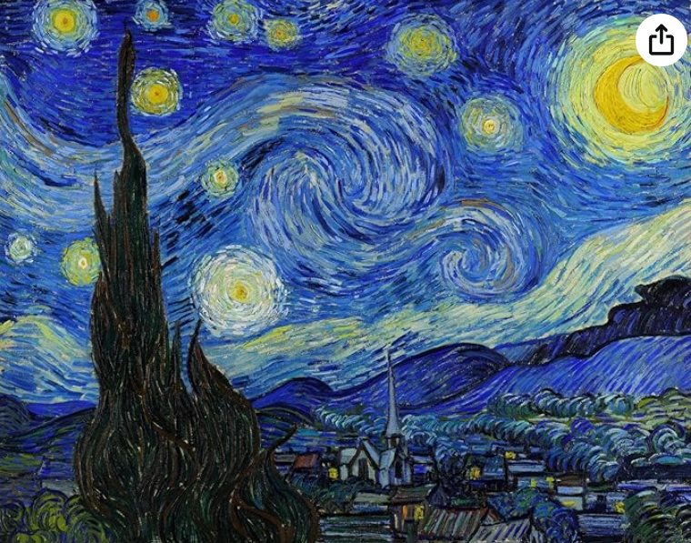
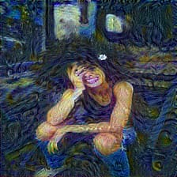

# Artify 🎨

**Artify** is a neural style transfer project that uses deep learning to merge the artistic style of one image with the content of another. By leveraging a pre-trained convolutional neural network (CNN), Artify allows users to create visually stunning artwork by applying the style of famous paintings (or any style image) to their own photos.





_Above: Example of neural style transfer with Van Gogh's Starry Night applied to a portrait picture_

## 🚀 Features

- **Customizable Styles**: Transfer any painting's style to your own images.

- **Multiple Pre-Trained Models**: Choose from different CNN architectures (like VGG16, VGG19).

- **Easy-to-Use Interface**: Intuitive controls for artists and developers alike.

## 🖼️ How It Works

Neural style transfer works by extracting features from two images:
1. **Content Image**: The image you want to stylize (e.g., your photo).
2. **Style Image**: The image whose style you want to apply (e.g., a painting).

The algorithm optimizes a new image by preserving the content of the content image and the style from the style image. It uses a CNN to extract the content and style features and iteratively adjusts a new image to match these features.

## 📦 Installation

1. Clone this repository:

   ```bash
   <!-- for backend -->

   git clone https://github.com/your-username/artify.git
   cd artify
   pip install -r requirements.txt
   python app.py

   <!-- for frontend -->
   cd frontend
   npm install
   npm run dev